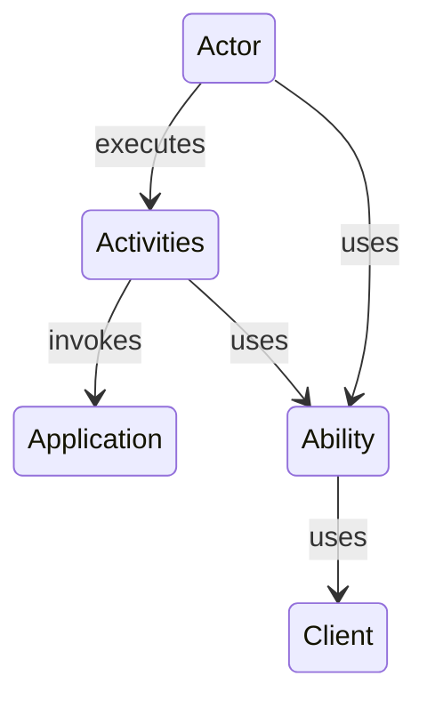

# Thekla4j
[](https://mvnrepository.com/artifact/com.test-steps.thekla4j)

## The Screenplay Pattern

The Screenplay Pattern is a design pattern used in automated testing that encourages good testing practices, 
such as high readability, maintainability, and reusability. 
It is an evolution of the Page Object Model, where actors (users) perform interactions (activities) on the system 
through abilities (tools or interfaces). The pattern is highly descriptive and maps closely to the business domain, 
making it easier for non-technical stakeholders to understand.

**Pros:**
- High readability: The pattern is descriptive and maps closely to the business domain, making it easier for non-technical stakeholders to understand.
- Reusability: Interactions and abilities are reusable across different tests, reducing code duplication.
- Maintainability: Changes in the UI or business logic often only require changes in one place, making the tests easier to maintain.

**Cons:**
- Learning curve: The Screenplay Pattern is more complex than other patterns like the Page Object Model, so it can take time to learn and implement correctly.
- Overhead: The pattern can be overkill for simple applications or small test suites.
- Limited adoption: As it's a relatively new pattern, there are fewer resources and community support compared to more established patterns.

The original Screenplay Pattern describes the concept of a question which is used to query the system under test to 
verify its state. The current implementation does not include questions, as it can be easily replaced by activities.
It makes the pattern more straightforward and easier to understand.




## Installation

Thekla4j consists of multiple modules that can be used together or separately. The core module 
provides the main functionality, while additional modules provide specific abilities, such as interacting 
with a web browser or sending HTTP requests.

Currently, the following modules are available:

- `thekla4j-core`: The [core module](./features/core/CORE.md) that provides the main functionality for the Screenplay Pattern.
- `thekla4j-http`: A [module](./features/web/http/---HTTP---.md) that provides the ability to send HTTP requests.
- `thekla4j-browser-selenium`: A [module](./features/web/browser/---BROWSER---.md) that provides the ability to interact with a web browser using Selenium.

To install Thekla4j, add the following dependencies to your project:

###  Gradle

Add the following dependency to your `build.gradle` file:

```gradle
dependencies {
    implementation group: "com.test-steps.thekla4j", name: "thekla4j-core", version: <THEKLA4J_VERSION>
    implementation group: "com.test-steps.thekla4j", name: "thekla4j-http", version: <THEKLA4J_VERSION>
    implementation group: "com.test-steps.thekla4j", name: "thekla4j-browser-selenium", version: <THEKLA4J_VERSION>
}
```

### Maven

Add the following dependency to your `pom.xml` file:

```xml
<dependencies>
    <dependency>
        <groupId>com.test-steps.thekla4j</groupId>
        <artifactId>thekla4j-core</artifactId>
        <version>THEKLA4J_VERSION</version>
    </dependency>
    <dependency>
        <groupId>com.test-steps.thekla4j</groupId>
        <artifactId>thekla4j-http</artifactId>
        <version>THEKLA4J_VERSION</version>
    </dependency>
    <dependency>
        <groupId>com.test-steps.thekla4j</groupId>
        <artifactId>thekla4j-browser-selenium</artifactId>
        <version>THEKLA4J_VERSION</version>
    </dependency>
</dependencies>
```

## Usage

To use Thekla4j, you need to create an actor and define the abilities that the actor has. Abilities are the tools or 
interfaces that the actor uses to interact with the system under test. 
For example, if you want the actor to interact with a web browser, you would give the actor the `BrowseTheWeb` ability.

Here is an example of how to create an actor with the `BrowseTheWeb` ability:

```java
import com.teststeps.thekla4j.assertions.Expected;
import com.teststeps.thekla4j.browser.core.Element;
import com.teststeps.thekla4j.browser.core.locator.By;
import com.teststeps.thekla4j.browser.selenium.ChromeBrowser;
import com.teststeps.thekla4j.browser.spp.abilities.BrowseTheWeb;
import com.teststeps.thekla4j.browser.spp.activities.Click;
import com.teststeps.thekla4j.browser.spp.activities.Enter;
import com.teststeps.thekla4j.browser.spp.activities.Navigate;
import com.teststeps.thekla4j.browser.spp.activities.Title;
import com.teststeps.thekla4j.commons.error.ActivityError;
import com.teststeps.thekla4j.core.activities.See;
import com.teststeps.thekla4j.core.base.persona.Actor;
import org.junit.jupiter.api.Test;

import java.util.function.Function;


public class TestBasicBrowseTheWebExample {

  @Test
  public void browseTheWeb() throws ActivityError {

    Actor actor = Actor.named("TestUser")
      .whoCan(BrowseTheWeb.with(ChromeBrowser.withoutOptions()));

    Element googleSearchField = Element.found(By.xpath("//input[@name='q']"))
      .called("Google Search Field");

    Element googleSearchButton = Element.found(By.xpath("//input[@name='btnK']"))
      .called("Google Search Button");

    actor.attemptsTo(

        Navigate.to("https://www.google.com"),

        Enter.text("thekla4j").into(googleSearchField),

        Click.on(googleSearchButton),

        See.ifThe(Title.ofPage())
          .is(Expected.to.pass(title -> title.contains("thekla4j"))))

      .getOrElseThrow(Function.identity());
  }
}

```


## License

Thekla4j is licensed under the MIT License. See the [LICENSE](./LICENSE.md) file for more information.